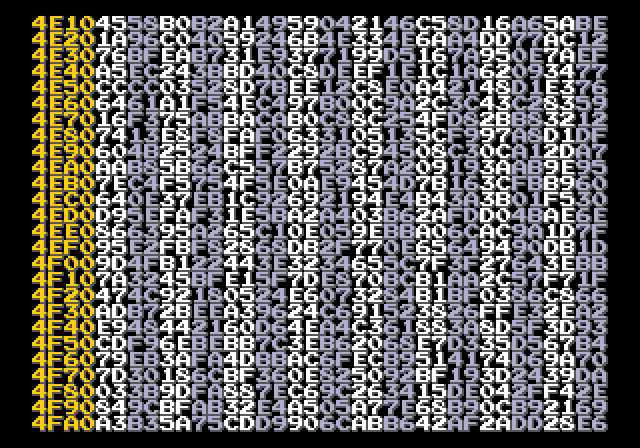

# RAM viewer

Some quick RAM viewer for Mega Drive. Does *not* touch RAM, so you should be
able to see the 64 KB intact as it's on boot (however, flashcart firmware
will probably mess with RAM, so unless you're debugging that you should
consider getting a plain flashcart without firmware)

No license for this thing, do whatever you want with it.

## How to use

* Press up/down to scroll up/down
* Hold down A, B or C to go faster
* Hold down several buttons to go even faster

## Building

On Linux:

* Grab an assembler and [`mdtiler`](https://github.com/sikthehedgehog/mdtools)
* Modify `build.sh` to point to the tools
* Run it

On Windows: ...look at `build.sh` and write the equivalent BAT file :P
